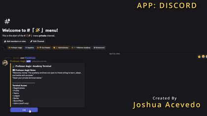
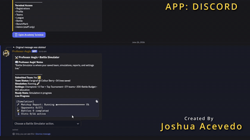
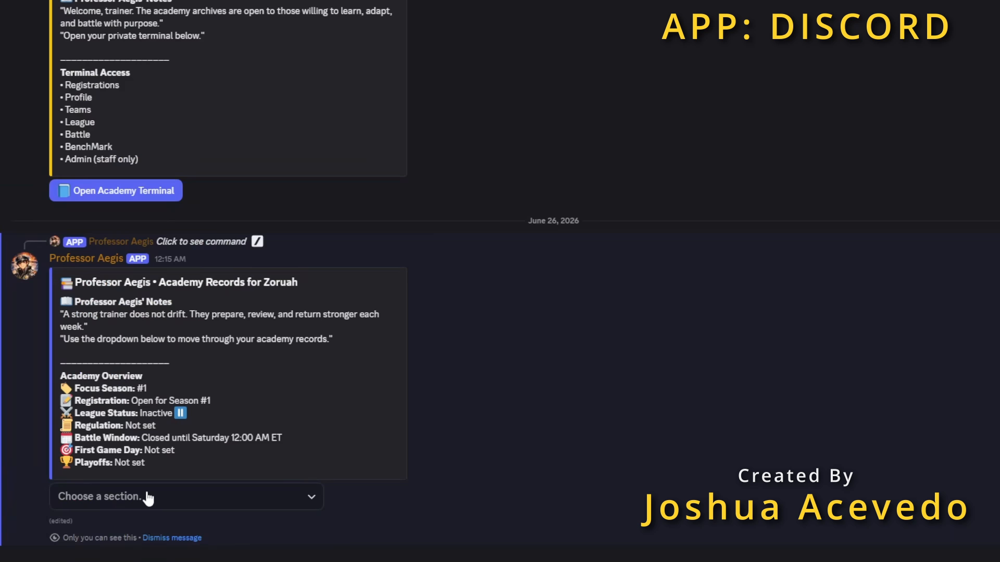
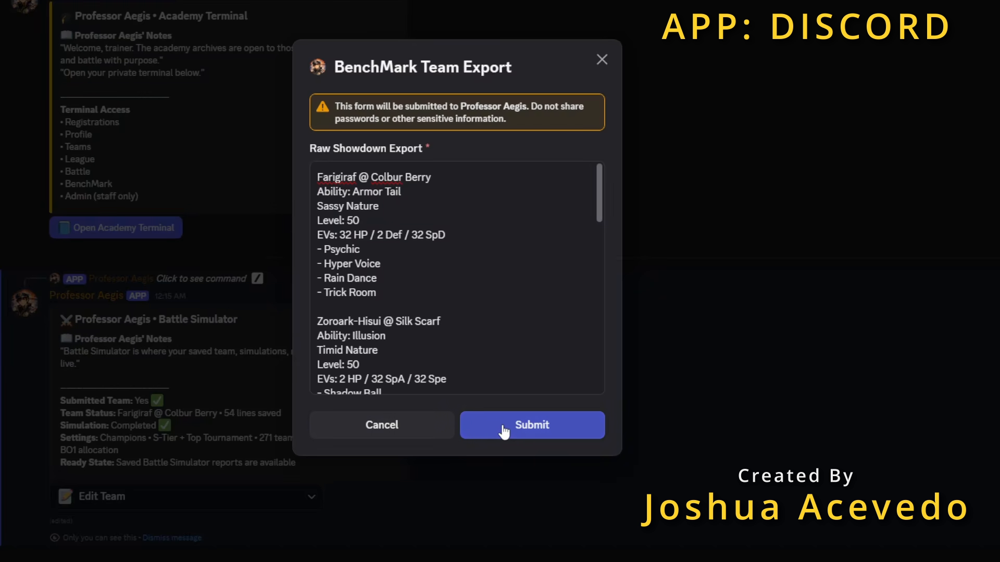
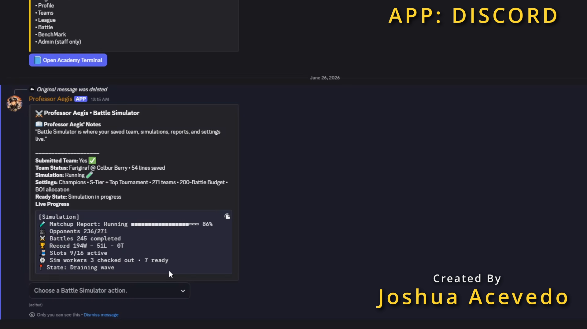
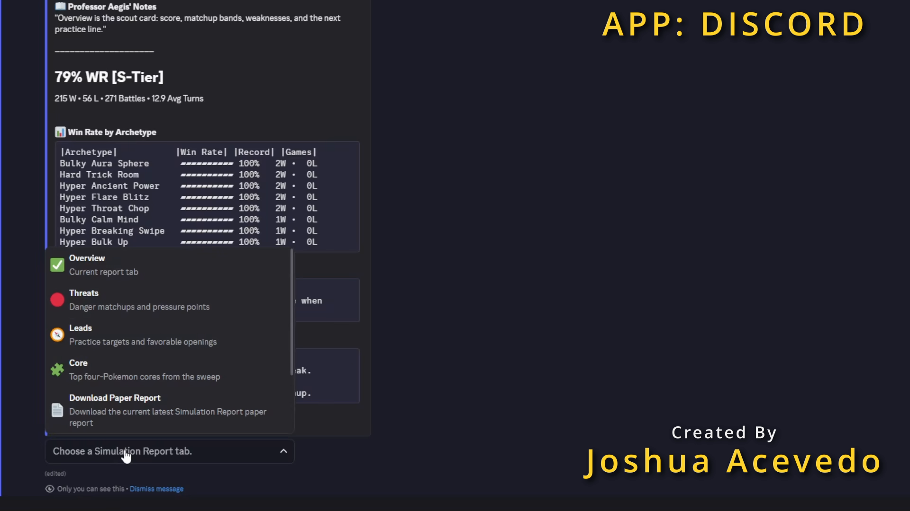

# ProfessorAegis

ProfessorAegis is a discontinued Discord-based competitive battle league and benchmark assistant. It is preserved as the legacy prototype that led into [BattleLab](https://github.com/Zoruahful/BattleLab), the newer installable app version of the same idea.

- **Status:** Legacy prototype, discontinued in favor of BattleLab
- **Runtime:** Node.js, Discord.js, Python
- **Interface:** Discord slash commands, menus, modals, and report workflows
- **Focus:** League operations, team registration, battle tracking, benchmark workers, report generation, and Python/JavaScript service orchestration

## Demo

| MENU FLOW | SIMULATION FLOW |
| --- | --- |
|  |  |

| ACADEMY RECORDS | TEAM EXPORT | SIMULATION RUNNING | REPORT OVERVIEW |
| --- | --- | --- | --- |
|  |  |  |  |

## Project Flow

ProfessorAegis was built around a Discord server workflow:

1. Register players and teams through Discord interactions.
2. Manage league state, battle records, and player profile data.
3. Submit or monitor battle links from Pokemon Showdown.
4. Run benchmark/report workflows through JavaScript services and Python workers.
5. Generate structured reports, archives, and review artifacts for players.

## Simulation Approach

ProfessorAegis benchmarks a submitted team by validating a Pokemon Showdown export, selecting opponents from configured benchmark pools, and running battle jobs through local worker processes. The battle mechanics come from a local Pokemon Showdown simulator; ProfessorAegis handles orchestration, legal action selection, progress tracking, and report generation.

- **Worker-driven battle loop:** The benchmark worker starts simulation jobs, sends packed teams into Pokemon Showdown, listens for team-preview, switch, and move requests, then responds with valid choices.
- **Opponent selection:** Benchmark modes choose from curated or tournament-style opponent pools, with seedable selection when a repeatable sample is needed.
- **Move-selection policy:** The BattleBrain policy is deterministic and heuristic-based, not machine learning. It scores legal moves using visible battle state: base power, accuracy, spread damage, type effectiveness, STAB, target HP, turn order, active speed control, Fake Out timing, Protect streaks, field conditions, and current win/loss pressure.
- **Short-term memory:** Recent choices, failed moves, immunities, misses, Protect interactions, damage events, switches, and status updates are tracked so the policy avoids obvious repeats and adjusts targets when a previous action failed.
- **Report output:** Completed runs are summarized into win/loss/tie records, opponent breakdowns, progress states, and report cards that can be reviewed from Discord.

This keeps the simulation explainable: every decision comes from visible state and scoring rules, making it easier to debug than an opaque model while still producing useful benchmark evidence.

## Engineering Highlights

- **Discord.js interaction shell:** Handles slash commands, buttons, selects, modals, embeds, and admin-only flows.
- **JavaScript service layer:** Splits league, registration, battle, profile, menu, database, and benchmark responsibilities into separate service modules.
- **Python benchmark workers:** Uses Python services for heavier simulation, analysis, replay rendering, and report pipeline work.
- **Worker orchestration:** Supports local benchmark worker endpoints and asynchronous job polling from the Discord-facing bot.
- **Persistence path:** Includes SQLite-era support with PostgreSQL migration utilities and connection checks.
- **Report generation:** Builds battle and benchmark artifacts from structured runtime data.
- **Open-source handoff:** Keeps credentials, caches, local databases, generated archives, and local process-manager files out of the repository.

## Project Structure

| Path | Purpose |
| --- | --- |
| `index.js` | Discord bot entry point, menu routing, command handlers, admin checks, and runtime orchestration. |
| `deploy-commands.js` | Registers Discord slash commands for a configured Discord application and guild. |
| `services/` | JavaScript and Python service modules for league workflows, benchmark processing, database access, reports, and workers. |
| `database/postgres/` | PostgreSQL client, setup scripts, connection checks, and migration support utilities. |
| `scripts/` | Local helper scripts for icon syncing and parity checks. |
| `assets/pokemon-icons/` | Icon manifest contract and cache policy; downloaded icons are intentionally ignored. |
| `Media/GitHub` | README screenshots, GIF previews, and full demo captures. |

## Key Code

- `index.js`: Discord client setup, interaction routing, admin gates, menu hydration, and bot startup.
- `services/database.js`: SQLite/PostgreSQL persistence boundary and data access helpers.
- `services/BenchMark.js`: Discord-facing benchmark menu and report interaction flow.
- `services/benchmarkService.js`: JavaScript bridge between Discord flows and benchmark worker jobs.
- `services/benchmarkWorker.py`: Python HTTP worker for benchmark and report processing.
- `services/benchmark_battle_runner.py`: Python simulation runner and fallback BattleBrain policy path.
- `services/benchmark_persistent_sim_worker.js`: Reusable Node/Pokemon Showdown worker with the primary BattleBrain move-selection policy.
- `services/benchmark_engine.py`: Core benchmark scoring and analysis routines.
- `services/benchmark_showdown.py`: Pokemon Showdown readiness, validation, and helper integration.
- `services/benchmark_paper_report.js`: HTML/report rendering support.

## How to Run

Requirements:

- Node.js 20 or newer
- Python 3.11 or newer
- A Discord application and bot token from the Discord Developer Portal
- Optional: PostgreSQL for database testing or migration work
- Optional: a local Pokemon Showdown checkout for advanced benchmark features

Clone:

```bash
git clone https://github.com/Zoruahful/ProfessorAegis.git
cd ProfessorAegis
npm install
```

Create local environment settings:

```powershell
Copy-Item .env.example .env
```

For Bash:

```bash
cp .env.example .env
```

Fill in your own Discord application values:

```text
DISCORD_TOKEN=your-discord-bot-token
CLIENT_ID=your-discord-application-client-id
GUILD_ID=your-discord-test-guild-id
```

Register commands for your test guild:

```bash
npm run deploy
```

Start the bot:

```bash
npm start
```

Optional local worker:

```bash
python services/benchmarkWorker.py
```

Some league defaults are server-specific. Set `TRAINER_ROLE_ID`, `ADMIN_USER_IDS`, and `ADMIN_ROLE_IDS` in `.env` for your own Discord server.

## Validation

Useful local checks:

```bash
node --check index.js
node --check deploy-commands.js
python -m py_compile services/benchmarkWorker.py
npm run db:postgres:test
```

The repository does not currently include a full automated test suite. Runtime validation requires a private Discord application, a test guild, and local environment settings.

## BattleLab Successor

ProfessorAegis is no longer the main development target. The successor project is [BattleLab](https://github.com/Zoruahful/BattleLab), which moves the concept toward a modern installable desktop/web app using TypeScript and React.

ProfessorAegis remains useful as a portfolio project because it shows the earlier Discord-based architecture, Python worker pipeline, JavaScript orchestration, and the practical migration path from bot workflows into an application.

## Scope

This repository is a legacy open-source prototype, not a hosted service. It is intended for code review, learning, forks, and local experimentation. Users must create their own Discord application credentials and should review server-specific defaults before running it in a live community.

Pokemon and Pokemon Showdown related names and assets belong to their respective owners. This project is an unofficial educational/portfolio project and is not affiliated with Nintendo, Game Freak, Creatures, The Pokemon Company, Smogon, or Pokemon Showdown.
